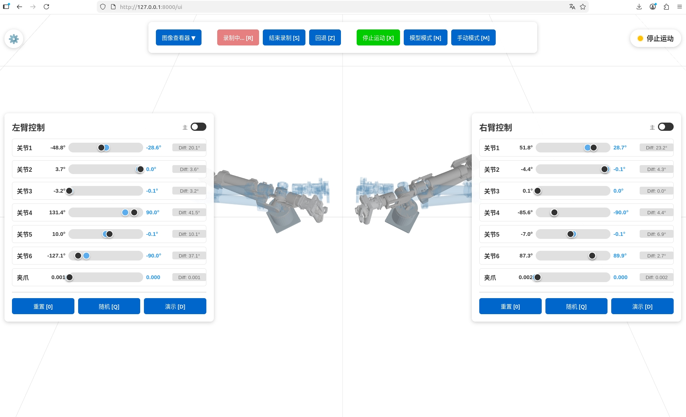

# Dagger Data Collection
用于接管采集，数据格式为pdd

# Installation
* 需要安装一些额外的包
```bash
conda activate dos-w1
pip install pdd-misc -U -i https://pypi.megvii-inc.com/simple
pip install websocket
pip install uvicorn
pip install fastapi
```

# Usage
## 1. 配置config文件
目前已完成配置，仅需要修改camera的序列号及数据存储路径
## 2. 启动驱动
```bash
./whole_start.sh
```
## 3. 启动采集脚本
```bash
python data_collection.py
```
## 4. 打开浏览器进行采集

* 只有启动采集脚本后，才能打开浏览器。每次启动后刷新即可
### （1） 打开[127.0.0.1:8000/ui](127.0.0.1:8000/ui)
### （2）点击开始录制开始录制，结束录制结束
### （3）手动模式
* 手动模式需要主从在比较接近的位置，进入后可以进行相对joint操作
* 前端会有urdf重影及slide滑块提示，提示哪个关节没有对齐
* 建议从停止模式进入，如果采集员已经很熟练可以尝试从模型模式无缝切换
### （4）模型模式
接收远程模型指令并进行控制，接口及格式请阅读源码
### （5）停止模式
* 停止运动。无论是手动模式还是模型模式，均可进入这个模式停止运动
* 建议停止录制前先进入停止模式，方便后处理

## 5. TIPS
* 保存的机器人数据中，每一行都会有对应的模式字段（0,1,2对应停止，手动，模型模式）
* 开始录制后，可以从前端查看3个摄像头的实时画面
* 前端的各个按钮均有对应的键盘，建议使用脚踏板绑定对应按键